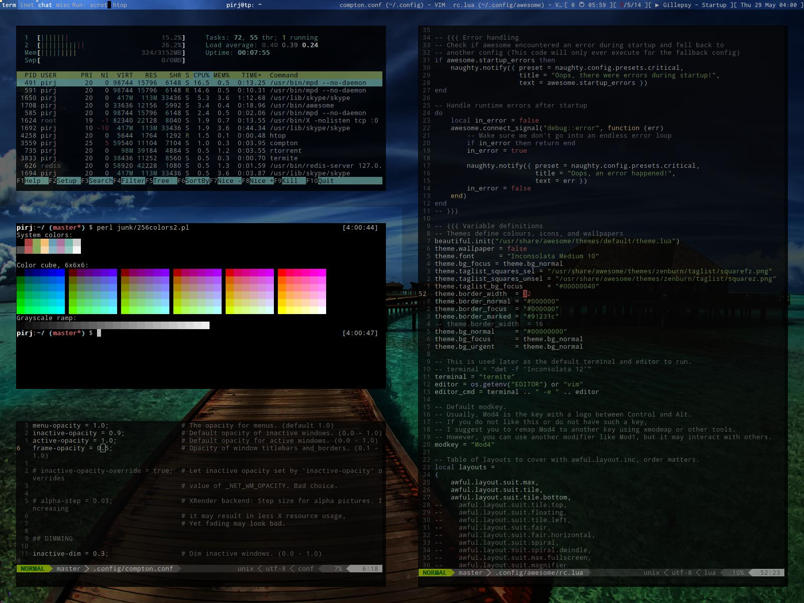

= Humble dotfiles

Born 2013. Written and cherry-picked with love.

== What's inside

Mostly tmux, vim, git, zsh, urxvt, ruby, js, awesome wm.
Should work in most Linux'es, OSX and BSD. Tested on ArchLinux, OSX 10.11 and OpenBSD.

== Installation

    git clone --recursive --depth 1 --single-branch https://github.com/pirj/dotfiles
    mv dotfiles/.* .
    rm -rf dotfiles
    mkdir .tmp

=== OSX specific

Tell iTunes [not to grab the keys](http://superuser.com/questions/31925/what-can-i-do-to-stop-the-play-pause-button-from-opening-itunes/827710#827710):

    launchctl unload -w /System/Library/LaunchAgents/com.apple.rcd.plist

Tell Karabiner to use custom keyboard mappings:

Left command + mute to switch audio output (from internal speakers/headphones to Bluetooth expernal speaker):

    /Applications/Karabiner.app/Contents/Library/bin/karabiner enable private.command_l_media_mute

Media keys to control MPD instead of iTunes:

    /Applications/Karabiner.app/Contents/Library/bin/karabiner enable private.media_next
    /Applications/Karabiner.app/Contents/Library/bin/karabiner enable private.media_play
    /Applications/Karabiner.app/Contents/Library/bin/karabiner enable private.media_prev

Swith to primary keyboard layout with Right Alt, to secondary with Left Alt:

    /Applications/Karabiner.app/Contents/Library/bin/karabiner enable private.russian_optionL2optionL_russian
    /Applications/Karabiner.app/Contents/Library/bin/karabiner enable private.russian_optionR2optionR_english

Swap colon and semicolon, but only for primary, US layout:

    /Applications/Karabiner.app/Contents/Library/bin/karabiner enable private.swapcolonsus

Map Command + P to Command + O (avoid annoying print dialog):

    /Applications/Karabiner.app/Contents/Library/bin/karabiner enable private.cmdptocmdo

Swap ~ and ` (if you use ~ more ofter):

    /Applications/Karabiner.app/Contents/Library/bin/karabiner enable remap.programmer.backtick_tilde

Prevent Chrome from emailing the page when mistyping Command+Option+I with Command+Shift+I:

    defaults write com.google.Chrome NSUserKeyEquivalents -dict-add 'Email Page Location' '\0'
    defaults write com.google.Chrome.canary NSUserKeyEquivalents -dict-add 'Email Page Location' '\0'

[No clamshell mode](https://github.com/pirj/noclamshell) and [no backlight trick](https://github.com/pirj/nobacklight):

    curl https://raw.githubusercontent.com/pirj/noclamshell/master/noclamshell.plist > ~/Library/LaunchAgents
    curl https://raw.githubusercontent.com/pirj/nobacklight/master/nobacklight.plist > ~/Library/LaunchAgents
    launchctl load ~/Library/LaunchAgents/nobacklight.plist
    launchctl load ~/Library/LaunchAgents/noclamshell.plist

== Inspiration sources

I use to browse repositories on GH, and check other people's dotfiles. dotshare.it is another interesting source.

== Packages

=== On ArchLinux (pacman)

Query (-Q) package list without version numbers (-q), only those explicitly installed (-t) and not required directly by other packages (-tt), native (-n) and foreign (-m):

    pacman -Qqettn >! .packages.native
    pacman -Qqettm >! .packages.foreign

Install:

    sudo pacman -S $(< .packages.native )
    aurget -S $(< .packages.foreign )

=== On OSX (homebrew)

Show installed formulae that are not dependencies of another installed formula:

    brew leaves >! .formula
    brew cask list >! .casks

Install:

    brew install $(< .formula )
    brew cask
    brew cask install $(< .casks)

== TODO

* explain what works:
** vim
** command line, shell
** ruby workflow
* vim plugin bootstrap? pathogen?
* how to install aurget?
* how to install all those aur packages?
* bsd packages?

== About me

Phil Pirozhkov, software engineer
